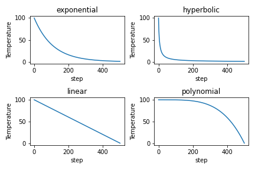
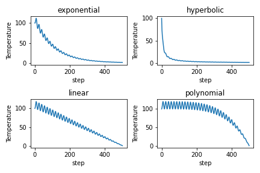
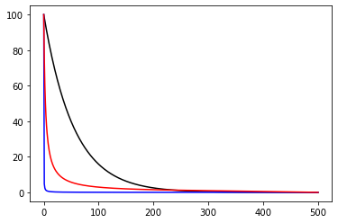
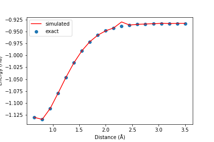
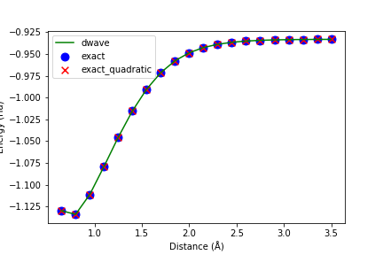
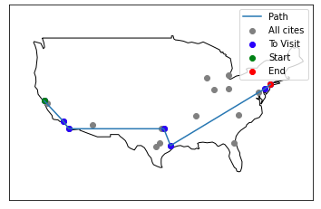
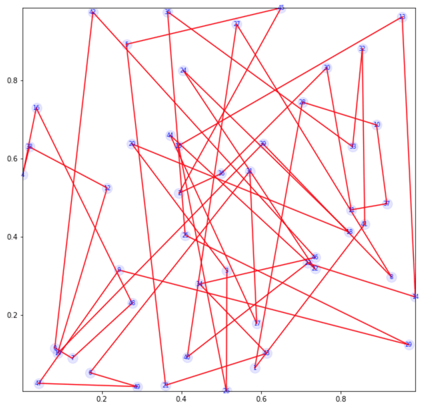

## Project 4: Ising Annealing

This final project guides through the process of mapping an electronic structure Hamiltonian to a classical Ising model, and then solving for the groundstate of the model using a thermal anneling Monte Carlo (MC) simulation. This is yet another method as opposed to the other methods used in the first two projects that used RBMs and VQE, respectively.
The strategy of this project is to map the electronic structure Hamiltonian problem to a clasical problem, then to use methods such as Monte Carlo simulation to implement _thermal annealing_. Thermal annealing is a probabilistic technique for approximating the global optimum of a given function by exploiting thermal fluctuations of the system under study. As for the Monte Carlo simulation, the Metropolis-Hastings (MH) algorithm is used.
For very brief introduction to the main ideas behind the project, and the basics of the Monte Carlo method are summarized
[here.](https://github.com/CDL-Quantum/CohortProject_2020/blob/master/CDL_2020_docs.pdf)  
And in the [Project 4 Landing Page](./Project4_LandingPage.pdf),a more technical information on the Ising Hamiltonians is provided.

## Tasks:
**Task 1: 2D ferromagnetic Ising Model**   
In this task we are given a solution to an MC simulation that employs MH algorithm for 2D ferromagnetic (J>0) Ising Model on square lattice with periodic boundary conditions (PBCs).  

}\sigma_i\sigma_j" width="200">  

The probability distribution of the Ising model at temperature T is given by the Gibbs distribution:   

  

where Z(T) is the normalization constant (also known as the partition function),  describes one of (exponentially) many possible microscopic configurations that the system can be in, H is the corresponding energy (Hamiltonian). So the goal is to sample configurations from the distribution P. As the partition function requires exponential resources to compute, the MH algorithm is employes instead as approximation to original problem. 

In our [Task 1 jupyter notebook](./Task_1.ipynb) the procedure is implemented using initial and final temperatures T=100 and T=0.01, respectively with exponentially decaying schedule. 

The notebook contains the object `Ising2DPBC` which creates an instance of an ising model by specifying the 2D grid and the parameter J. This object can compute the energy for the specified system and the energy difference that results from flipping one of the sites in the grid. The object `Ising2DPBC` inherits from the `AbstractIsing` parent class implemented in the `common/abstract_ining.py` file which also performs the Monte-Carlo step using Metropolis-Hastings algorithm.  
Another nice feature is implemented in the `common/ising_animator.py` file. It creates an animation of the Ising Lattice simulation following the given annealing schedule. Here is an animation of the 2D Ising model:  

 

**Task 2: 1D random bond nearest neighbor, and random bond fully connected Ising models**   
In this task we investigate two 1D models - random bond nearest neighbor Ising model  

}B_{ij}\sigma_i\sigma_j" width="200">

  

 and a fully connected random bond Ising model

   

where B = +1 or -1.  

 Our main focus here is the analysis of different temperature decay schedules to find out which one works best. We have considered **exponential**, **hyperbolic**, **linear** and **polynomial** schedules, and **oscillating variations** thereof. Below are the plots for the mentioned schedules: 

 

To benchmark different schedules for different models, we also considered a hybrid scheduling, which is a mix of two parts - hyperbolic, lowering the temperature rapidly, then transforming into linear until the end. The blue and black curves in the figure are the hyperbolic and the exponential schedules, presented for comparison.   

  

The analysis shows (see our [Task 2 jupyter notebook](./Task_2.ipynb) for details) that a new hybrid schedule works best for the nearest neighbor random model, and the exponential schedule works best for the fully connected model.   

Timing of calculations for 10, 20, 21, 22, 50, 100 spins was done in [Google Colab notebook](./Week4_Task_123.ipynb) and clearly demonstrated that up to size 20 one can do a fast full-space calculation to obtain the exact ground state. Calculations above 25 are requiring too much memory to be done via brute force full-space calculations and after size 20 the annealing approach delivers the ground state energy much faster than full-space calculations.    

(**Challenge 1**) Finally, we apply the obtained knowledge to a particular model of fully connected ising model, which is the Mattis model ("glass"). This challenge is implemented in the same jupyter notebook for Task 2. As expected, at the end of the annealing procedure we confirm that we've found the ground state by checking that 𝜉i is equal to  𝜎𝑖  up to a global sign, i.e. if we multiply the spin configuration elementwise with 𝜉, we will get all 1s, or all -1s.

**Task 3: Electronic Structure Calculations using Generalized Ising Hamiltonians**   
In this task we look at the hydrogen molecule and show, that its hamiltonian can be written in polynomial form, i.e. as a generalized Ising model. Then this Ising model is used along with the software framework developed in previous tasks to find the ground state of the Hydrogen molecule using simulated thermal annealing of the corresponding Ising model. 

  

The left figure above shows the energies (exact and from simulated annealing results for the generalized Ising model) for different bond distances for Hydrogen molecule. The data for loading into our generalized Ising model are provided in the `./hamiltonians` folder (it would be good to have more data corresponding to smaller bond distances to see the familiar full curve and not only the minimum and the right part). As we can see there is a good correspondence.

(**Challenges 2 and 3**)   
The right figure above is the comparison between:  
- the exact model for full generalized 4-body Ising model,
- the model run on the Dwave's commercial software,
- and the `GeneralizedIsingModel` devised in this task.   

For the last two cases we have used the function `poly_to_quadratic` function implemented using `dimod.make_quadratic`(**Challenge 2)**.   
As can be seen they are all in line with the other solutions.  
See more details on the code implementations and demos in our [Task 3 jupyter notebook](./Task_3.ipynb).

The importance of taking into account the 3-body and 4-body interactions in a multi-particle system is demonstrated in the figure below. The annealing was performed on the truncated Hamiltonian that contains only up-to 2-body interaction terms to determine the lowest energy configuration. Then the 3- and 4-body terms are evaluated as in first-order perturbation theory. The figure shows that at large distances where the 3- and 4-body interactions are small this recovers the correct ground state energy. However, as one moves close to R=1 A the results start to drift away from the correct ground state energy. For more details take a look at the [Google Colab notebook Week4_Task_123.ipynb](./Week4_Task_123.ipynb).

At the end of the [Google Colab notebook Week4_Task_123.ipynb](./Week4_Task_123.ipynb) we also test run other 3- and 4-body Hamiltonians for H2 and H4 generated using the tools from week2 [Week2_Hamiltonian_gen notebook](./Week2_Hamiltonian_gen.ipynb). Note that we had to use JW (Jordan-Wigner) mapping because the BK (Bravyi-Kitaev) has a bug as noticed in the week 2 cohort project notebooks. 

**Challenge 4:** 
We have explored a few different problems using thermal annealing for NP-complete adn NP-hard problems:

1. Planning a trip from the current location of a rental car that has to visit specific cities in the USA is solved and visualized using the [Car Rental Schedule notebook](./Car_Rental_Trip.ipynb). See the figure below for a trip from San Francisco to New York City with few stops in popular destinations.
2. Another implementation of Traveling Salesman Problem [TSP notebook](./TSP.ipynb). featuring solving on random graphs using D-Wave Leap Hybrid as well as simulator. See the figure below for a random 50 cities route. 
  &nbsp;

3. Implementation of Graph vertex coloring, which is a NP-Complete problem can be found in the [Graph coloring notebook](./Vertex_Coloring.ipynb).

## Business Application
The business application is described in [Business Application file](./Business_Application.md)
